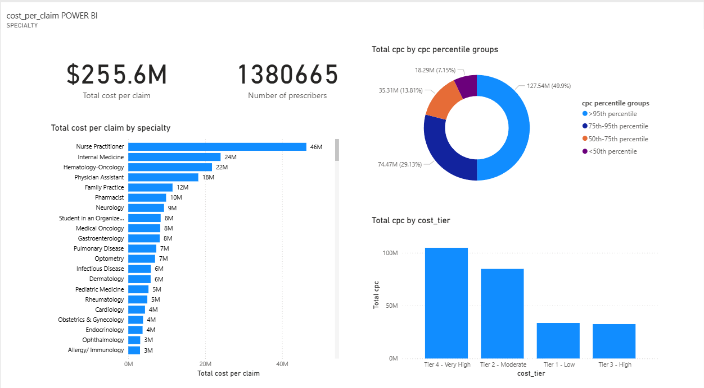

## medicare-part-d-2023-prescriber-tier-segmentation-and-cost-analysis

This is a cost-per-claim (cpc) analysis of the Medicare Part D 2023 claims data that uncovers high-cost outliers, high-cost prescribing patterns and assigns a cost-tier system for cost management strategies.

## BUSINESS CONTEXT
The Centres for Medicare & Medicaid Services (CMS) provides health coverage to more than 100 million people through Medicare, medicaid, the Children's Health Insurance Program, and the Health Insurance marketplace. CMS seeks to strengthen and modernize the Nation's health care system, to provide access to high quality care and improved health at lower costs. The insights from this analysis will be used by Part D program claims managers and finance executives to develop targeted intervention for high-tier claims, optimise capital allocation and cost-saving measures. The following business questions represent the focus of the analysis:

•	what proportion of prescribers are responsible for most of the total cost per claim spending?

•	what prescriber cost segment is responsible for most of the Medicare Part D claims spending?

•	what prescriber specialty in the top 5% of prescribers by cost-per-claim impacts Medicare Part D claims spending the most?

•	what is the brand/generic prescribing rate of specialties in the top 5% of the cost per claim metric?

## DATA SOURCE AND STRUCTURE
The CMS Part D 2023 dataset consists of a table of 1,380,665 rows and 85 columns of claims data aggregated by prescriber npi. A detailed data processing documentation is provided in this [data_processing_walkthrough](data_processing_walkthrough.md) link.

DASHBOARD PREVIEW

## EXECUTIVE SUMMARY

Tiers 3 & 4 are the high & very-high prescribers respectively and collectively account for $138m of the $257m in total cpc values representing 53.7% of total cpc. They also make up 6.3% (i.e., 76,000) of the approximately 1.38 million prescribers in the program. the top 5% of prescribers account for 50% of total cpc values. Prescribers in the top 5% recorded an average brand drug prescribing rate of over 90%. The allergy/immunology specialty recorded the highest cpc value of $356,000 in one claim while the hematology Oncology specialty recorded the highest total cpc of all the specialties at $21.5m.

## INSIGHTS DETAIL

•	Top 5% of prescribers by cpc contributed 50% of the total cpc 

•	Tier 3 & 4 prescribers 6.28% contributed 53.7% of the total cpc

•	Allergy/immunology specialty with the highest cpc value ($356,000) of the top 5% of prescribers recorded a brand drug prescribing rate of 93.91%

•	An unnamed specialty with the highest average cpc value ($50,000) of the top 5% of prescribers recorded a 100% brand drug prescribing rate

•	Hematology oncology with the highest total cpc value ($21.5M) of the top 5% of prescribers recorded an 83.23% brand drug prescribing rate

KEY RECOMMENDATION

Set up modalities to reduce the claims spending on Tiers 3 & 4 precribers by 50% and see a $70m savings on claims payment.

PRESCRIBED ACTIONS TO ACHIEVE THE KEY RECOMMENDATION

•	Audit Tier 3 & 4 prescribers: with unexplainably high cpc values to detect fraud, for educational purposes or formulary control

•	Offer formulary adherence support: to prescribers with low generic dispensing rate but high cost per claim or provide preferred alternatives to brand drugs

•	Shift Tiers 3 & 4 to Tiers 1 & 2: Focus on shifting the prescribing pattern of tier 3 and 4 prescribers to that of prescribers in the Tier 1 and 2 categories

PROJECT WORKFLOW
1. Data download - Medicare Part D 2023 dataset from CMS website.
2. Data storage & exploration - Loaded CSV into local database (PostgreSQL/MySQL) via Beekeeper + SQL shell.
3. Data preprocessing - Wrote SQL scripts to create staging table (part_d_2023_raw), created a cleaned table (part_d_2023_cleaned) from the staging table. Normalised part_d_2023_cleaned (1.38 million rows and 85 columns) into seven smaller tables with meaningful entities and relationships.
4. Analysis queries - Developed SQL queries for KPIs (cost per claim, generic & brand prescribing percentage, etc).
5. Visualization - Imported cleaned data into Power BI, built a multi-page report with KPIs and prescriber cost tier segmentation.

  

REFERENCES

•	The CMS Medicare Part D Prescribers 2023 – by Provider can be found publicly at https://data.cms.gov/provider-summary-by-type-of-service/medicare-part-d-prescribers/medicare-part-d-prescribers-by-provider/data 

•	The Power BI dashboard can be found at https://app.powerbi.com/groups/me/dashboards/4269d628-0fbf-4f02-944e-d01237268b26?experience=power-bi

•	The Power BI report can be found at https://app.powerbi.com/groups/me/reports/c35d9d7f-a391-4dbf-969d-1683c2738344/97bd24a7defe58ea664c?experience=power-bi

