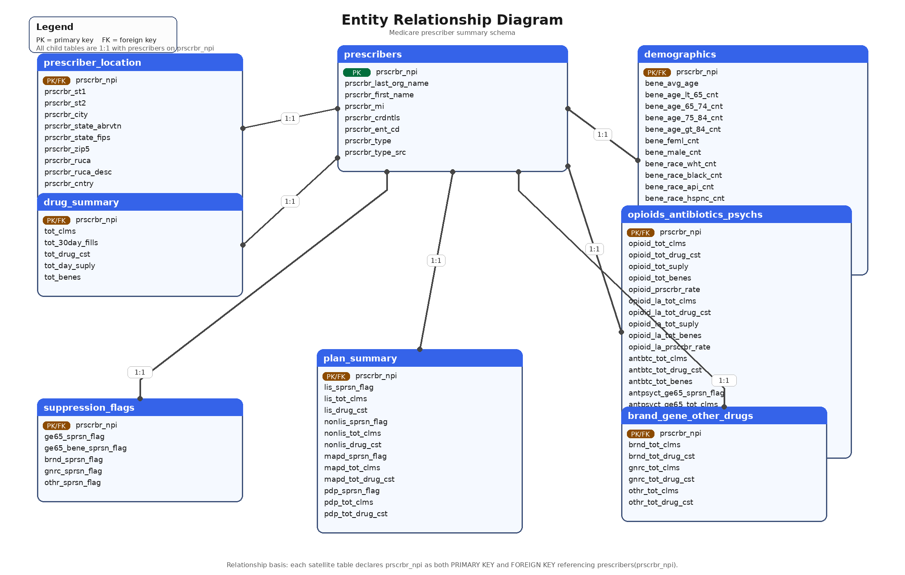
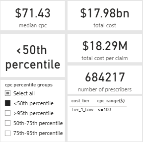
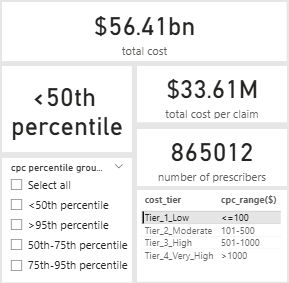
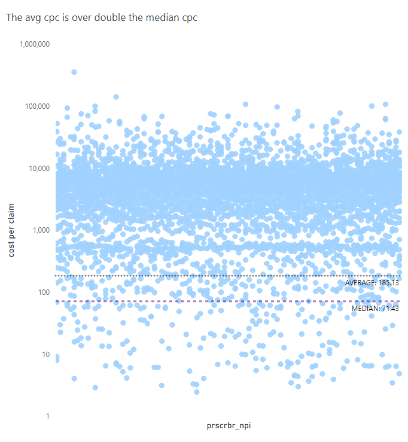
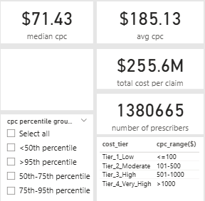
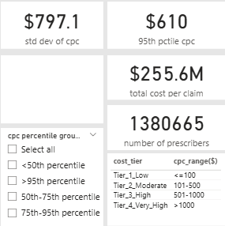
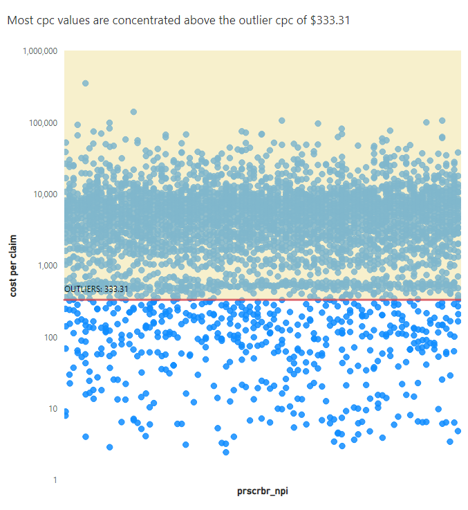
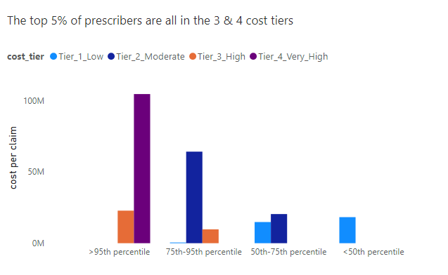
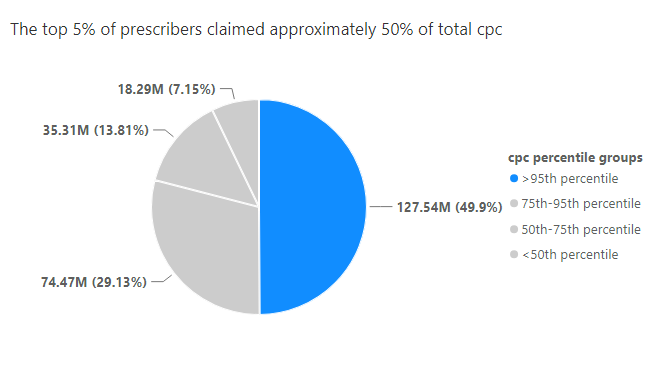
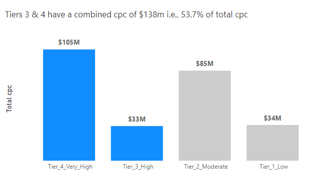

## medicare-part-d-2023-prescriber-tier-segmentation-and-cost-analysis

This is a cost-per-claim (cpc) analysis of the Medicare Part D 2023 claims data that aims to uncover high-cost claimants, discover high-cost prescribing patterns and assign a cost-tier system for the development of cost management strategies.

## BUSINESS CONTEXT
The Centres for Medicare & Medicaid Services (CMS) provides health coverage to more than 100 million people through Medicare, medicaid, the Children's Health Insurance Program, and the Health Insurance marketplace. CMS seeks to strengthen and modernize the Nation's health care system, to provide access to high quality care and improved health at lower costs. The insights from this analysis will be used by the Part D program's claims managers and finance executives to understand and develop targeted intervention for high-tier claims, optimise capital allocation and implement cost-saving measures. The following business questions represent the focus of the analysis:

•	what proportion of prescribers are responsible for most of the total cost per claim spending?

•	what prescriber cost segment is responsible for most of the Medicare Part D claims spending?

•	what prescriber specialty in the top 5% of prescribers by cost-per-claim impacts Medicare Part D claims spending the most?

•	what is the brand/generic prescribing rate of specialties in the top 5% of the cost per claim metric?

## DATA STRUCTURE & DETAIL
The CMS Part D 2023 dataset consists of a table of 1,380,665 rows and 85 columns of claims data aggregated by prescriber npi. In other words, each represents a prescriber with a unique prescriber npi. A detailed data processing documentation is provided in this [data_processing_walkthrough](data_processing_walkthrough.md) link.

DASHBOARD PREVIEW

## EXECUTIVE SUMMARY

Tiers 3 & 4 are the 'high' & 'very-high' cpc prescribers respectively and they collectively account for $138m of the $257m in total cpc values which represent 53.7% of total cpc. They also make up 6.3% (i.e., 86,000) of over 1.38 million prescribers in the program. The top 5% of prescribers account for approximately 50% of total cpc values. Furthermore, prescribers in the top 5% recorded an average brand drug prescribing rate of over 90%. The allergy/immunology specialty recorded the highest cpc value of approximately $356,000 in one claim while the hematology Oncology specialty recorded the highest total cpc of all the specialties at $21.5m.

## INSIGHTS DETAIL

STATISTICAL INSIGHTS (what do the numbers tell us about the data?)

- Fact 1: the median (50% percentile) cpc value is $71.43.
- Inference: at least half (684,217) of the prescribers in the program have a cpc value that is less than or equal to $71.43.

- Fact 2: 865,012 prescribers are tier 1, therefore, have cpc values that are less than or equal to $100.
- Inference: a vast majority of prescribers in the program are low ticket prescribers (<$100 cpc) and exert the least financial impact on overall claims expenditure.

- Fact 3: the average cpc value of $185.13 is more than double the median cpc of $71.43. In other words, a small number of high cpc values have inflated the average cpc and are pulling it upwards and away from the median.
- Inference: the average cpc is misleading because it is not a true representation of a typical cpc value.

 
- Fact 4: the standard deviation (tells us how far apart each data point is from the average) cpc value of $797.10 is greater than the cpc value of the top 5% of prescribers ($610). 
- Inference: the variance between the standard deviation and the average is driven largely by prescribers in the top 5% based on cpc. The data is not behaving normally, is extremely skewed and likely has high-end ouliers. Therefore, the standard deviation in this case will be a poor tool for predictive analysis of future cpc outcomes.

- Fact 5: the outlier cpc value is $333.31 and most cpc values in the data are well above the outlier cpc.
- Inference: outlier cpc values are responsible for an elevated average cpc

COST CONCENTRATION INSIGHTS (who is driving high cpc?)

- Fact 6: The top 5% of prescribers are all in cost tiers 3 & 4
- Inference: A focus on tiers 3 & 4 prescribers for targeted cost management will likely see dividends in reduced claim expenditure.

- Fact 7: The top 5% of prescribers by cpc claimed approximately 50% of the total cpc.
- Inference: most of the CMS claims expenditure is driven by a few prescribers.

- Fact 8: Tiers 3 & 4 prescribers collectively account for $138m of the $257m in total cpc values which represents 53.7% of total cpc.
- Inference: program policy measures that reduce the combined cpc of tiers 3 & 4 prescribers by a quarter or half will save the program $34.5m or $69m in total cpc respectively. 

- Fact 9: The Allergy/immunology specialty recorded the highest cpc ($356,000) of the top 5% of prescribers and a brand drug prescribing rate of 93.91%.

- Fact 10: An unnamed specialty with the highest average cpc value ($50,000) of the top 5% of prescribers recorded a 100% brand drug prescribing rate.

- Fact 11: Hematology oncology with the highest total cpc value ($21.5M) of the top 5% of prescribers recorded an 83.23% brand drug prescribing rate.

- Inference: a high brand prescribing rate may be a culprit in high cpc figures. However, further investigation is required to ascertain the cause.

## RECOMMENDATION

1. Create modalities that reduce the cpc values of tiers 3 & 4 precribers by 50% to yield a $69m savings in total cpc.

2. Audit Tier 3 & 4 prescribers for formulary control, to uncover possible fraud and for educational purposes.

3. Offer formulary adherence support to prescribers with low generic dispensing rate and high cost per claim.
  
4. Provide preferred alternatives to brand drugs to improve generic prescribing patterns.

5. institute and implement policy changes that aim to shift the prescribing pattern of tiers 3 and 4 prescribers to that of cost tiers 1 and 2.

•	The Power BI dashboard can be found at https://app.powerbi.com/groups/me/dashboards/4269d628-0fbf-4f02-944e-d01237268b26?experience=power-bi

•	The Power BI report can be found at https://app.powerbi.com/groups/me/reports/c35d9d7f-a391-4dbf-969d-1683c2738344/97bd24a7defe58ea664c?experience=power-bi

